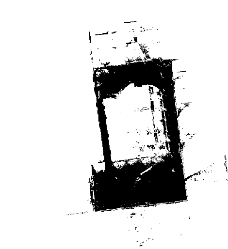
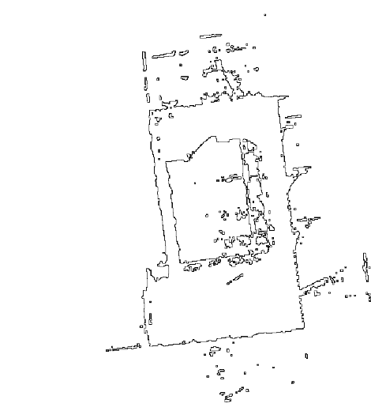

# warp-assignment
This repo was created for a selection task at WARP.ai for an Interdisciplinary Project(IDP) at Techinal University of Munich(TUM).

### Task Description
Consider a binary map, where 1 represents drivable area and 0 is undrivable 

 

Implement the following two processing steps:
1. Get a binary matrix with the boundaries of non-drivable areas (Figure 2 as anexample).
2. Convert the boundary matrix from above into a list of boundary segments (i.e. pieces of the boundary line)

**NOTE** : For Part 1 only Python adn Numpy should be used 
### Dependencies
numpy       :              1.18.1

python       :             3.8.2

scipy         :            1.3.3    
### How to run
`python src/find_boundary.py`

## TODO:
- Add Unit tests

### Author :
Devendra Vyas ([@skatoosh](https://github.com/skat00sh))

